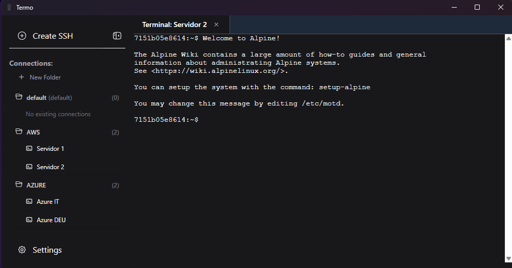

<p align="center">
  
</p>

<h1 align="center">Termo - Minimalist & Secure SSH Client</h1>


<p align="center">
  <a href="https://github.com/tu-usuario/termo/blob/main/LICENSE"></a>
  
  
  
  
</p>

<p align="center">
  
</p>

---

## 🚀 About the Project

**Termo** is a **minimalist, fast, and secure SSH client** designed to simplify the management of multiple servers.  
Our main goals are **speed**, **security**, and a **keyboard-first philosophy** for maximum productivity.

---

## ✨ Features

- 🔐 **SSH connection using password or private key**
- 📥 **Import connections from:**
  - mRemoteNG  
- ➕ **Unlimited sessions and folder creation**
- 🔍 **Quick connection search with command palette**
- 🌍 **Languages supported:** English, Spanish
- 🔑 **Master key encryption for enhanced security**
- ⌨️ **Keyboard-first design philosophy for power users**
- ✅ **Secure support for legacy password-based connections**

---

## 🎯 Key Objectives

- Simplify server connection management for environments with many servers.
- Provide a **clean and minimalistic interface**.
- Guarantee **secure storage of credentials**.
- Enable **fast navigation and control via keyboard shortcuts**.

---

## 🤝 How to Contribute

We welcome contributions from the community! Follow these steps:

1. **Fork** the repository.
2. **Create a new branch** for your feature:
   ```bash
   git checkout -b feature/new-feature
   ```
3. **Commit** your changes:
    ```
    git commit -m "Added new feature"
    ```
4. **Push** your branch:
    ```
    git push origin feature/new-feature
    ```
5. **Open a Pull Request (PR) and describe your changes**.
✔️ Once reviewed and approved, your PR will be merged into production.

## 🛡️ Security

* All sensitive data (SSH keys, passwords) is encrypted with a master key.
* No external servers or third-party APIs involved – everything runs locally.
* Follow best practices for SSH security.
